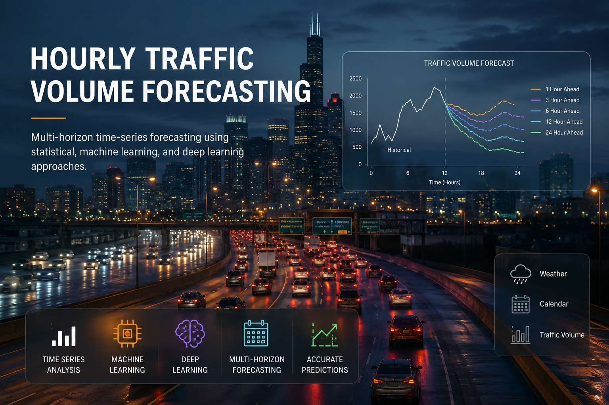

# Hourly Traffic Volume Forecasting


A multi-horizon time-series forecasting project for predicting hourly traffic volume using statistical, machine learning, and deep learning approaches.

The project evaluates four forecasting models across multiple prediction horizons and compares their performance using MAE, sMAPE, and MASE.

---



---

## 📌 Project Overview

Accurate traffic-volume forecasting is important for transportation planning, congestion management, infrastructure utilization, and intelligent transportation systems.

This project focuses on forecasting traffic volume at multiple future horizons using the **Metro Interstate Traffic Volume** dataset.

The forecasting horizons evaluated are:

- 1 hour ahead
- 3 hours ahead
- 6 hours ahead
- 12 hours ahead
- 24 hours ahead

Four different approaches were implemented and compared:

1. Seasonal Naive
2. Prophet
3. XGBoost
4. LSTM

The goal is not only to identify the best-performing model, but also to investigate how model performance changes as the forecasting horizon increases.

---

## 🎯 Objectives

The main objectives of this project are to:

- Analyze historical hourly traffic patterns.
- Investigate daily, weekly, and seasonal traffic behavior.
- Prepare the dataset for time-series forecasting.
- Engineer temporal and lag-based features.
- Develop multiple forecasting approaches.
- Evaluate models across multiple forecasting horizons.
- Compare models using consistent evaluation metrics.
- Identify the most suitable forecasting approach for different prediction horizons.

---

## 📊 Dataset

The project uses the **Metro Interstate Traffic Volume** dataset.

The dataset contains approximately 48,000 hourly observations of traffic volume on Interstate 94, together with weather and calendar-related information.

### Main information includes:

- Date and time
- Traffic volume
- Temperature
- Rain
- Snow
- Cloud coverage
- Weather description
- Holiday information

The raw dataset is **not included in this repository** because it is a relatively large data file.

The dataset can be obtained from the original UCI Machine Learning Repository:

[Metro Interstate Traffic Volume Dataset](https://archive.ics.uci.edu/dataset/492/metro+interstate+traffic+volume)

---
## 🚀 Quick Start

### 1. Clone the Repository

```bash
git clone https://github.com/anaboset/hourly-traffic-volume-forecasting
cd hourly-traffic-volume-forecasting: 
```
### 2. Install Dependencies
```bash
pip install -r requirements.txt
```
### 3. Download the Dataset

Download the Metro Interstate Traffic Volume dataset from the UCI Machine Learning Repository and place it inside the data/ directory.
The raw dataset is not included in this repository because of its size.

### 4. Run the Project

 Open the following notebook using Jupyter Notebook, JupyterLab, or Google Colab:
 ``` notebooks/Traffic_Hourly_Forecasting(3).ipynb```
Run the notebook cells sequentially to reproduce the data preprocessing, feature engineering, model training, validation, and evaluation process.

### 5. View the Results

The complete model comparison is available in:

``` results/final_model_comparison.csv```

The best model for each forecasting horizon is available in:

``` results/best_model_by_horizon.csv```

The complete project documentation is available in:
```
docs/Traffic_hourly_forecasting.pdf
```
## 🔧 Methodology

The forecasting pipeline consists of several stages.

### 1. Data Preparation

The raw traffic dataset was loaded and inspected for:

- Missing values
- Duplicate timestamps
- Timestamp continuity
- Data types
- Invalid or inconsistent records

The timestamp column was converted to datetime format and used as the time index.

Duplicate timestamps were investigated before being removed.

### 2. Time-Series Preparation

The dataset was organized into hourly time-series segments.

Large temporal gaps were handled separately to prevent artificial continuity across disconnected periods.

Weather-related missing values were handled using appropriate forward-filling or interpolation techniques within valid segments, while traffic-volume gaps were preserved where necessary to avoid introducing artificial target values.

### 3. Exploratory Data Analysis

Exploratory analysis was performed to understand the main traffic patterns, including:

- Overall traffic trends
- Hourly traffic patterns
- Weekly patterns
- Seasonal behavior
- Traffic-volume distributions
- Relationships between traffic and other variables

The generated visualizations are available in the `figures/` directory.

---

## ⚙️ Feature Engineering

Several time-dependent features were created to help the forecasting models capture temporal patterns.

### Lag Features

The following lag values were used:

- 1 hour
- 24 hours
- 168 hours

These represent:

- Previous hour
- Same hour on the previous day
- Same hour during the previous week

### Rolling Features

Rolling statistics were created using:

- 3-hour rolling mean
- 3-hour rolling standard deviation
- 24-hour rolling mean
- 24-hour rolling standard deviation

Rolling features were shifted before calculation to prevent future information from leaking into the model.

### Calendar Features

Calendar-based features included:

- Hour
- Day of week
- Month
- Weekend indicator
- Holiday indicator

Cyclical transformations were also used to represent repeating temporal patterns.

---

# 🤖 Forecasting Models

## 1. Seasonal Naive

Seasonal Naive was used as the baseline forecasting model.

The model predicts future traffic using a previous observation from the same seasonal period.

This provides a simple benchmark for determining whether more complex models provide meaningful improvements.

---

## 2. Prophet

Prophet was used as a statistical time-series forecasting model.

The implementation included:

- Daily seasonality
- Weekly seasonality
- Yearly seasonality
- Weather-related regressors
- Holiday-related information

Prophet provides a useful comparison against machine learning and deep learning approaches.

---

## 3. XGBoost

XGBoost was trained using engineered temporal, lag, rolling, calendar, and weather features.

The model was trained independently for each forecasting horizon:

- 1 hour
- 3 hours
- 6 hours
- 12 hours
- 24 hours

XGBoost was evaluated using expanding-window time-series cross-validation before final testing.

---

## 4. LSTM

A Long Short-Term Memory (LSTM) neural network was implemented to model sequential dependencies in traffic-volume observations.

The LSTM used sequences of historical observations together with weather and temporal features.

The model was evaluated across the same five forecasting horizons as the other models.

The final trained LSTM model and scaler are included in the `models/` directory.

---

# 📏 Evaluation Metrics

Three metrics were used to evaluate forecasting performance.

### Mean Absolute Error (MAE)

MAE measures the average absolute difference between predicted and actual traffic volume.

**Lower values indicate better performance.**

### Symmetric Mean Absolute Percentage Error (sMAPE)

sMAPE measures forecasting error as a percentage while treating positive and negative errors symmetrically.

**Lower values indicate better performance.**

### Mean Absolute Scaled Error (MASE)

MASE compares model performance against a seasonal baseline.

A MASE value below 1 indicates that the model performs better than the baseline.

**Lower values are better.**

---

# 📈 Results

The models were evaluated on the final test set at five forecasting horizons:

- 1 hour
- 3 hours
- 6 hours
- 12 hours
- 24 hours

## Best Model by Forecasting Horizon

| Horizon | Best Model | MAE | sMAPE (%) | MASE |
|---:|---|---:|---:|---:|
| 1 hour | **XGBoost** | **176.1365** | **7.4493** | **0.5197** |
| 3 hours | **XGBoost** | **216.5343** | **9.4532** | **0.6390** |
| 6 hours | **XGBoost** | **246.7107** | **11.2880** | **0.7280** |
| 12 hours | **LSTM** | **274.6781** | **12.1764** | **0.8105** |
| 24 hours | **Seasonal Naive** | **318.6929** | **11.6681** | **0.9404** |

### Complete Results

The complete comparison of all four models and all forecasting horizons is available in:

[`results/final_model_comparison.csv`](results/final_model_comparison.csv)

The best-performing model for each horizon is summarized in:

[`results/best_model_by_horizon.csv`](results/best_model_by_horizon.csv)

---

# 🔍 Key Findings

### Short-Term Forecasting

XGBoost achieved the best performance at the 1-hour, 3-hour, and 6-hour horizons.

Its strongest result was obtained at the 1-hour horizon:

- **MAE:** 176.1365
- **sMAPE:** 7.4493%
- **MASE:** 0.5197

This demonstrates the effectiveness of lag, rolling, calendar, and weather features for short-term traffic prediction.

### Medium-Term Forecasting

At the 12-hour horizon, LSTM achieved the best performance:

- **MAE:** 274.6781
- **sMAPE:** 12.1764%
- **MASE:** 0.8105

This suggests that the sequential model was able to capture useful temporal dependencies at this forecasting horizon.

### Long-Term Forecasting

At the 24-hour horizon, the Seasonal Naive baseline achieved the best performance:

- **MAE:** 318.6929
- **sMAPE:** 11.6681%
- **MASE:** 0.9404

This result demonstrates the strength of the daily seasonal pattern in the traffic data.

### Prophet Performance

Prophet produced the highest error across all evaluated horizons.

Its MASE remained approximately 1.8 across the forecasting horizons, indicating that it did not outperform the baseline used in this experiment.

---

## ⚠️ Limitations

- The dataset represents traffic from a single interstate location, so results may not generalize to other roads or regions.
- The models were evaluated on historical data and may perform differently under unusual events or traffic disruptions.
- The available weather and calendar features may not capture all factors affecting traffic volume.
- LSTM performance can be sensitive to architecture and hyperparameter choices.
- The study focuses on point forecasts and does not provide prediction intervals or uncertainty estimates.

---

# 🏆 Overall Conclusion

The experiments demonstrate that there is **no single model that dominates across every forecasting horizon**.

The best-performing approach depends on how far into the future the prediction is required:

- **XGBoost** is the strongest model for short-term forecasting up to 6 hours.
- **LSTM** performs best at the 12-hour horizon.
- **Seasonal Naive** performs best at the 24-hour horizon.
- **Prophet** performed poorly compared with the other approaches in this experiment.

These results highlight the importance of evaluating forecasting models across multiple horizons rather than selecting a model based on a single prediction horizon.

---

# 📁 Project Structure

```text
hourly-traffic-volume-forecasting/

├── docs/
│   └── Traffic_hourly_forecasting.pdf
│
├── figures/
│   ├── comparison/
│   ├── eda/
│   ├── Lstm/
│   ├── Prophet/
│   └── xgboost/
│
├── models/
│   ├── lstm_final.keras
│   ├── lstm_scaler.pkl
│   ├── xgboost_1h_final.pkl
│   ├── xgboost_3h_final.pkl
│   ├── xgboost_6h_final.pkl
│   ├── xgboost_12h_final.pkl
│   └── xgboost_24h_final.pkl
│
├── notebooks/
│   └── Traffic_Hourly_Forecasting(3).ipynb
│
├── results/
│   ├── best_model_by_horizon.csv
│   └── final_model_comparison.csv
│
├── .gitignore
├── requirements.txt
├── traffic.png
└── README.md
